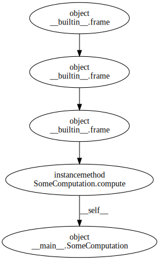
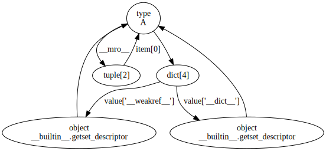

User Guide
==========

Exploring currently live objects
--------------------------------

The |snapshot| function lets you take a snapshot of the current state of the
Python interpreter, returning a graph of all *tracked* objects and the
references between them.  This can be useful for finding out what's
keeping objects alive.

.. note::
   Simple objects like integers and strings are not tracked by the cyclic
   garbage collector, so they won't show up in the graph returned by
   |snapshot|.

Here's a worked example.  We start with a simple asynchronous worker::

    def worker(jobs_queue, results_queue):
        while True:
            job = jobs_queue.get()
            result = job()
            results_queue.put(result)

It listens for incoming jobs on a queue, performs the computation represented
by each job, and puts the result on another results queue.  We'll start it
running on a separate thread like this::

    try:
        from queue import Queue  # Works in Python 3.
    except ImportError:
        from Queue import Queue  # Python 2 fallback.
    import threading

    jobs_queue, results_queue = Queue(), Queue()
    t = threading.Thread(target=worker, args=(jobs_queue, results_queue))
    t.daemon = True
    t.start()

Now we create some computations, feed them to the worker, and wait for and
print the results::

    class SomeComputation(object):
        def __init__(self, value):
            self.value = value

        def compute(self):
            return self.value**2

    def do_some_computations(jobs_queue, results_queue):
        computations = [SomeComputation(n) for n in [11, 15, 17]]
        for computation in computations:
            jobs_queue.put(computation.compute)
        for computation in computations:
            print(results_queue.get())

    do_some_computations(jobs_queue, results_queue)

So far, so good.  But now we notice that for some reason, after the
``do_some_computation`` call, there's still an instance of ``SomeComputation``
alive.  In this simple case that's not really an issue, but imagine replacing
``SomeComputation`` with something more complicated that's holding onto
a system resource of some kind.  We want to find out what's keeping it alive,
and how we can fix the problem.  We run the above code under ``python -i``, and
take a snapshot::

    >>> import refcycle
    >>> snapshot = refcycle.snapshot()
    >>> snapshot
    <refcycle.object_graph.ObjectGraph object of size 5797 at 0x1004ca110>

An |ObjectGraph| acts as a container, so we can search through it for the
``SomeComputation`` instance::

    >>> computations = [obj for obj in snapshot
    ...                 if isinstance(obj, SomeComputation)]
    >>> computations
    [<__main__.SomeComputation object at 0x1004ca050>]
    >>> c = computations[0]

Now we can use the |ancestors| method to find out what's keeping references to
``c``.

    >>> snapshot.ancestors(c)
    <refcycle.object_graph.ObjectGraph object of size 5 at 0x10242db50>

In this particular case the graph of all ancestors is very small.  More
typically, that graph is much larger, so it's often convenient to limit the
search to a given number of generations, for example with::

    >>> snapshot.ancestors(c, generations=5)
    <refcycle.object_graph.ObjectGraph object of size 5 at 0x10242db10>

Either way, we can now export this graph as an image::

    >>> snapshot.ancestors(c).export_image('computations.svg')

This gives the following rather simple graph:

So it's the ``compute`` bound method keeping ``c`` alive (through its
``__self__`` reference).  What's keeping *that* alive is a *frame* object.  The
annotations for frame objects aren't terribly useful.  However, since that
frame object is still live we can find it and examine it to get some clues::

    >>> frame = snapshot.parents(snapshot.parents(c)[0])[0]
    >>> frame
    <frame object at 0x10033c7c0>
    >>> dir(frame)
    ['__class__', '__delattr__', '__doc__', '__format__', '__getattribute__',
     '__hash__', '__init__', '__new__', '__reduce__', '__reduce_ex__', '__repr__',
     '__setattr__', '__sizeof__', '__str__', '__subclasshook__', 'f_back',
     'f_builtins', 'f_code', 'f_exc_traceback', 'f_exc_type', 'f_exc_value',
     'f_globals', 'f_lasti', 'f_lineno', 'f_locals', 'f_restricted', 'f_trace']
    >>> frame.f_code
    <code object worker at 0x100465db0, file "worker.py", line 1>
    >>> frame.f_locals
    {'jobs_queue': <Queue.Queue instance at 0x100498dd0>,
     'job': <bound method SomeComputation.compute of
            <__main__.SomeComputation object at 0x1004ca050>>,
     'result': 289,
     'results_queue': <Queue.Queue instance at 0x1004c2ef0>}

We see that it's the frame locals keeping a reference to the bound method:
specifically, the ``job`` local variable.  Looking back at the original code,
the reason is clear: the ``job`` local variable retains its reference to the
``job`` until the ``get`` call on the job queue returns the *next* job.  And in
this case the fix is easy: add a ``del job`` to the end of the ``while`` loop.

Analysing garbage
-----------------

The |garbage| function allows you to capture cyclic garbage.  Let's start by
creating some cyclic garbage.  First we turn off the cyclic garbage collector
to prevent the garbage being collected before we have a chance to capure it.
We also collect any garbage created by the imports::

    >>> import refcycle
    >>> import gc
    >>> gc.disable()
    >>> gc.collect()
    0

Now let's create some reference cycles::

    >>> class A(object):
    ...     pass
    ... 
    >>> a = A()
    >>> b = A()
    >>> a.foo = b
    >>> b.foo = a
    >>> del a, b, A

After the ``del`` statement above, there are no external references either to
the two instances of ``A`` created, or to the class ``A``.  Let's collect the
garbage::

    >>> graph = refcycle.garbage()
    >>> graph
    <refcycle.object_graph.ObjectGraph object of size 10 at 0x10048ed50>
    >>> graph.export_image('garbage.svg')

The graph looks something like this:

.. image:: images/garbage.svg

You can see the cycle we created on the right-hand side, along with the
references from ``a`` and ``b`` to the class ``A``, and some cycles belonging
to ``A`` itself.  Now let's decompose the graph into its strongly connected
components, using the |strongly_connected_components| method::

    >>> sccs = graph.strongly_connected_components()
    >>> sccs
    [<refcycle.object_graph.ObjectGraph object of size 1 at 0x10181e890>,
     <refcycle.object_graph.ObjectGraph object of size 5 at 0x10181e550>,
     <refcycle.object_graph.ObjectGraph object of size 4 at 0x10181e610>]
    >>> sccs.sort(key=len)
    >>> sccs[-1].export_image('scc1.svg')
    >>> sccs[-2].export_image('scc2.svg')

.. image:: images/scc2.svg

Another useful method is the |source_components| method: this returns the
strongly connected components that aren't reachable from other strongly
connected components.  In the context of analysing cyclic garbage, these are
the cycles that are keeping the rest of the garbage alive.

    >>> graph.source_components()
    [<refcycle.object_graph.ObjectGraph object of size 4 at 0x1006a64d0>]

.. |ObjectGraph| replace:: :class:`~refcycle.object_graph.ObjectGraph`
.. |garbage| replace:: :func:`~refcycle.creators.garbage`
.. |snapshot| replace:: :func:`~refcycle.creators.snapshot`
.. |source_components| replace:: :meth:`~refcycle.i_directed_graph.IDirectedGraph.source_components`
.. |strongly_connected_components| replace:: :meth:`~refcycle.i_directed_graph.IDirectedGraph.strongly_connected_components`
.. |ancestors| replace:: :meth:`~refcycle.i_directed_graph.IDirectedGraph.ancestors`
