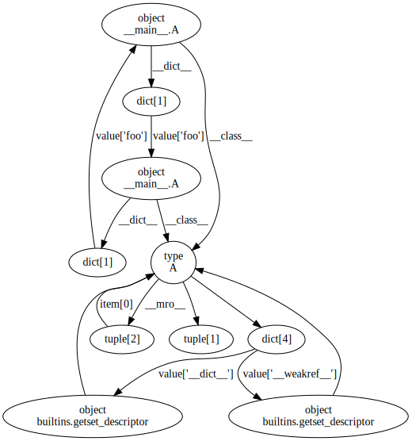
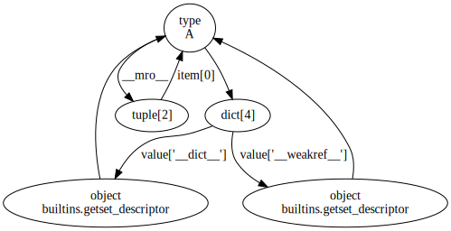
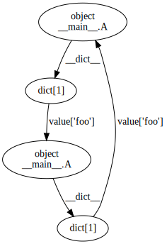

Analysing garbage
-----------------

The |garbage| function allows you to capture cyclic garbage.  Let's start by
creating some cyclic garbage.  First we turn off the cyclic garbage collector
to prevent the garbage being collected before we have a chance to capure it.
We also collect any garbage created by the imports::

    >>> import refcycle
    >>> import gc
    >>> gc.disable()
    >>> gc.collect()
    0

Now let's create some reference cycles::

    >>> class A(object):
    ...     pass
    ... 
    >>> a = A()
    >>> b = A()
    >>> a.foo = b
    >>> b.foo = a
    >>> del a, b, A

After the ``del`` statement above, there are no external references either to
the two instances of ``A`` created, or to the class ``A``.  Let's collect the
garbage::

    >>> graph = refcycle.garbage()
    >>> graph
    <refcycle.object_graph.ObjectGraph object of size 10 at 0x10048ed50>
    >>> graph.export_image('garbage.svg')

The graph looks something like this:

You can see the cycle we created on the right-hand side, along with the
references from ``a`` and ``b`` to the class ``A``, and some cycles belonging
to ``A`` itself.  Now let's decompose the graph into its strongly connected
components, using the |strongly_connected_components| method::

    >>> sccs = graph.strongly_connected_components()
    >>> sccs
    [<refcycle.object_graph.ObjectGraph object of size 1 at 0x10181e890>,
     <refcycle.object_graph.ObjectGraph object of size 5 at 0x10181e550>,
     <refcycle.object_graph.ObjectGraph object of size 4 at 0x10181e610>]
    >>> sccs.sort(key=len)
    >>> sccs[-1].export_image('scc1.svg')
    >>> sccs[-2].export_image('scc2.svg')

Another useful method is the |source_components| method: this returns the
strongly connected components that aren't reachable from other strongly
connected components.  In the context of analysing cyclic garbage, these are
the cycles that are keeping the rest of the garbage alive.

    >>> graph.source_components()
    [<refcycle.object_graph.ObjectGraph object of size 4 at 0x1006a64d0>]

.. |ObjectGraph| replace:: :class:`~refcycle.object_graph.ObjectGraph`
.. |garbage| replace:: :func:`~refcycle.creators.garbage`
.. |snapshot| replace:: :func:`~refcycle.creators.snapshot`
.. |source_components| replace:: :meth:`~refcycle.i_directed_graph.IDirectedGraph.source_components`
.. |strongly_connected_components| replace:: :meth:`~refcycle.i_directed_graph.IDirectedGraph.strongly_connected_components`
.. |ancestors| replace:: :meth:`~refcycle.i_directed_graph.IDirectedGraph.ancestors`
