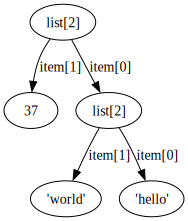

.. refcycle documentation master file, created by
   sphinx-quickstart on Sun Dec 15 10:25:17 2013.
   You can adapt this file completely to your liking, but it should at least
   contain the root `toctree` directive.

Refcycle: Visualisation and Analysis of Python Object References
================================================================

Release v\ |release|.

The refcycle package provides tools for analysing and visualising references
between Python objects, and for finding reference cycles and strongly connected
components of the object graph.  It provides an
:class:`~refcycle.object_graph.ObjectGraph` type for representing a collection
of Python objects and references between them.  For visualisation, it relies on
`Graphviz`_.

If you have `Graphviz`_ installed, and the ``dot`` executable is in
your path, then the following code::

    >>> import refcycle
    >>> a = [["hello", "world"], 37]
    >>> graph = refcycle.objects_reachable_from(a)
    >>> graph
    <refcycle.object_graph.ObjectGraph object of size 5 at 0x10191e2d0>
    >>> graph.export_image('example.svg')

will produce this image:

Features
--------

- Computation of strongly connected components.
- Snapshots of all currently tracked objects.
- Representation of garbage as a graph.
- Annotation of references and objects.
- Export and import from JSON for offline analysis.
- Use of Graphviz (if installed) for conversion to images.
- Compatible with Python 2 and 3.

Installing refcycle
-------------------

The refcycle project lives on Github, at
https://github.com/mdickinson/refcycle.
To install refcycle, do::

    $ git clone https://github.com/mdickinson/refcycle.git
    $ cd refcycle
    $ python setup.py install

Detailed Documentation
======================

.. toctree::
   :maxdepth: 2

   guide/index
   technical/index
   reference/index

.. _Graphviz: http://www.graphviz.org
.. _JSON: http://www.json.org
